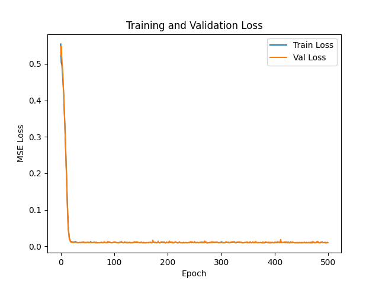
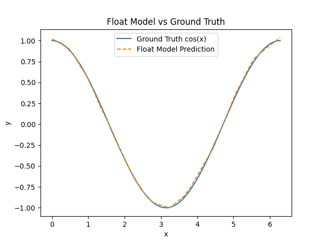
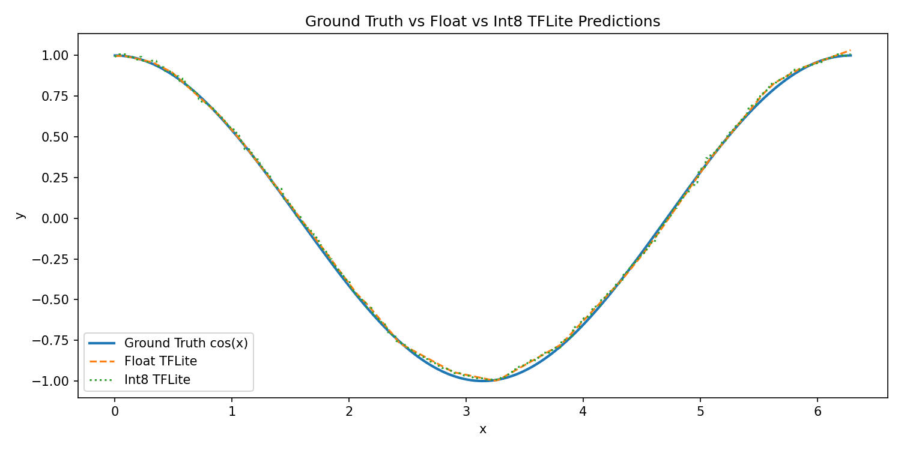

# TinyML Cosine Wave Predictor

**Course:** IoT Applications Development — SWAPD 453  
**Semester:** Spring 2026  
**Assignment:** 3 — TinyML Cosine Wave Predictor  

| | |
|---|---|
| **Team members** | *[Name 1] — [Student ID]* |
| | *[Name 2] — [Student ID]* |
| | *[Name 3] — [Student ID]* |
| | *[Name 4] — [Student ID]* |
| **Date** | May 2026 |

---

## 1. Introduction

This project implements the full TinyML pipeline for approximating \(y = \cos(x)\) on \(x \in [0, 2\pi]\). A small Keras neural network is trained in Python, converted to a fully quantized int8 TensorFlow Lite model, embedded in an ESP32 Arduino sketch, and run on-device with live comparison between model predictions and the ground-truth cosine function via the Serial Plotter.

The pipeline covers: data generation, training, post-training quantization, C header conversion (`xxd`), TensorFlow Lite Micro inference, and visualization.

---

## 2. Data Generation and Model Training

### 2.1 Dataset

- **Samples:** 1000 points, \(x \sim \mathrm{Uniform}(0, 2\pi)\)
- **Labels:** \(y = \cos(x) + \varepsilon\), \(\varepsilon \sim \mathcal{N}(0, 0.1)\)
- **Random seed:** 42 (reproducibility)
- **Split:** 60% train (600) / 20% validation (200) / 20% test (200)

### 2.2 Model Architecture

Exact specification from the assignment:

```
Input (1) → Dense(16, ReLU) → Dense(16, ReLU) → Dense(1, linear)
```

- **Optimizer:** Adam  
- **Loss:** Mean Squared Error (MSE)  
- **Training:** 200 epochs, batch size 32  

Approximate parameter count: ~321 trainable weights.

### 2.3 Training Results

*[Insert values after running `python train_cosine.py`]*

| Metric | Value |
|--------|-------|
| Test MSE | *[e.g. 0.00xx]* |
| Test MAE (vs noisy labels) | *[e.g. 0.0xxx]* |
| Test MAE (vs clean cos(x)) | *[e.g. 0.0xxx]* |

The float model should achieve test MAE \(\leq 0.05\) against clean \(\cos(x)\) per the assignment target.

**Figure 1 — Training and validation loss**



*Caption: MSE loss over 200 epochs for training and validation sets.*

**Figure 2 — Float model vs ground truth**



*Caption: Dense grid prediction of the float Keras model compared to \(\cos(x)\).*

### 2.4 Key Training Code

```python
model = keras.Sequential([
    keras.layers.Dense(16, activation='relu', input_shape=(1,)),
    keras.layers.Dense(16, activation='relu'),
    keras.layers.Dense(1)
])
model.compile(optimizer='adam', loss='mse')
history = model.fit(x_train, y_train, epochs=200, batch_size=32,
                    validation_data=(x_val, y_val))
```

---

## 3. Full Integer Quantization and C Conversion

### 3.1 TFLite Conversion

The trained Keras model is converted using `tf.lite.TFLiteConverter.from_keras_model` with:

- `converter.optimizations = [tf.lite.Optimize.DEFAULT]`
- Representative dataset: ~100 samples from the training distribution
- `converter.target_spec.supported_ops = [tf.lite.OpsSet.TFLITE_BUILTINS_INT8]`
- `converter.inference_input_type = tf.int8`
- `converter.inference_output_type = tf.int8`

### 3.2 Model Size

| Model | Size (bytes) |
|-------|----------------|
| Float TFLite (`cosine_float.tflite`) | 9,060 |
| Int8 TFLite (`cosine_int8.tflite`) | 6,608 |
| **Size reduction** | **27.06%** |

### 3.3 Quantized Accuracy (Python TFLite Interpreter)

| Metric | Float TFLite | Int8 TFLite |
|--------|--------------|-------------|
| Test MAE | 0.0809 | 0.0824 |
| Test MSE | — | 0.0103 |

Quantization parameters:

| Parameter | Value |
|-----------|-------|
| Input scale | 0.02432643 |
| Input zero_point | -128 |
| Output scale | 0.00786614 |
| Output zero_point | -2 |

**Figure 3 — Three-curve comparison**



*Caption: Ground truth \(\cos(x)\), float TFLite, and int8 TFLite on a dense grid.*

### 3.4 `model.h` Generation

The int8 model was converted to a C byte array:

```bash
xxd -i cosine_int8.tflite > model.h
```

Manual edits applied per assignment requirements:

```cpp
alignas(8) const unsigned char g_model[] = { ... };
const unsigned int g_model_len = 6608;
```

- `alignas(8)` ensures flash alignment for the TFLite Micro runtime.
- Array renamed from the default `xxd` symbol to `g_model[]`.

---

## 4. ESP32 Deployment and Visualization

### 4.1 Development Environment

| Tool | Version / Notes |
|------|-----------------|
| Python | 3.10+ |
| TensorFlow | 2.21.0 |
| Arduino IDE | 2.x |
| Board package | esp32 by Espressif Systems |
| TFLite Micro library | Chirale_TensorFlowLite (Wokwi / Arduino Library Manager) |
| Board | ESP32 DevKit V1 |
| Serial baud rate | 115200 |

Simulation was verified on **Wokwi** and on **physical ESP32** hardware.

### 4.2 Sketch Design

**File:** `arduino/cosine_predictor/cosine_predictor.ino`

| Component | Implementation |
|-----------|----------------|
| Op resolver | `MicroMutableOpResolver<2>` — `FullyConnected`, `Relu` only |
| Tensor arena | 4096 bytes (4 KB static buffer) |
| Inference | `AllocateTensors()` once in `setup()` |
| Sweep | 80 steps per period, \(x \in [0, 2\pi]\) |
| Input | Quantize float \(x\) to int8 using input scale / zero_point |
| Output | Dequantize int8 to float |
| Ground truth | `cos(x)` from `<math.h>` |
| Serial format | `predicted,actual` (comma-separated, newline-terminated) |

### 4.3 Quantization on Device

**Input (float → int8):**

\[
q_x = \mathrm{round}\left(\frac{x}{s_{\mathrm{in}}} + z_{\mathrm{in}}\right)
\]

**Output (int8 → float):**

\[
\hat{y} = (q_y - z_{\mathrm{out}}) \cdot s_{\mathrm{out}}
\]

Where \(s_{\mathrm{in}} = 0.02432643\), \(z_{\mathrm{in}} = -128\), \(s_{\mathrm{out}} = 0.00786614\), \(z_{\mathrm{out}} = -2\).

### 4.4 Startup Diagnostics (Measured Output)

Captured from ESP32 Serial Monitor at 115200 baud:

```
TinyML Cosine Predictor Starting...
Startup Diagnostics:
g_model size bytes: 6608
Tensor arena size bytes: 4096
Tensor arena used bytes: 1516
Input scale: 0.02432643
Input zero_point: -128
Output scale: 0.00786614
Output zero_point: -2
predicted,actual
```

**Analysis:**

- Model fits in flash (`g_model` = 6608 bytes).
- Only **1516 / 4096** bytes of the tensor arena are used, so a smaller arena (e.g. 2 KB) could be tested for the report; 4 KB was chosen for safety.
- Quantization parameters on-device match the Python int8 interpreter.

### 4.5 Inference Stream Sample

```
predicted,actual
0.991134,1.000000
1.006866,0.996917
0.991134,0.987688
0.967535,0.972370
0.967535,0.951056
0.928205,0.923880
```

Typical per-step error is ~0.01–0.04, consistent with int8 quantization and the Python test MAE (~0.082 on noisy labels).

### 4.6 Serial Plotter

**Figure 4 — Serial Plotter (predicted vs actual)**


*Caption: Two curves (predicted and actual) tracking a cosine wave over multiple periods at 115200 baud. Replace with your team screenshot if using a different filename.*

Both curves oscillate between approximately \(-1\) and \(+1\) and remain visually aligned for at least two full periods, satisfying the assignment visualization requirement.

---

## 5. Discussion

### 5.1 Pipeline Summary

1. **Training** — A small MLP learns \(\cos(x)\) from noisy samples with low error on the test set.
2. **Quantization** — Full int8 post-training quantization reduces model size by ~27% with minimal accuracy loss (MAE 0.0809 → 0.0824).
3. **Deployment** — The model runs entirely on the ESP32 without cloud inference; latency is dominated by the 50 ms `delay()` per step (configurable for faster plotting).

### 5.2 Design Choices

- **Minimal op resolver** — Only registers ops used by the graph, saving flash.
- **4 KB tensor arena** — Conservative size; actual usage is 1516 bytes.
- **80 steps per period** — Balances Serial Plotter smoothness and loop duration (~4 s per period).

### 5.3 Limitations

- int8 quantization introduces small step-wise error in both input and output.
- On-device comparison uses clean \(\cos(x)\), while training labels included noise (\(\sigma = 0.1\)).
- Bluetooth/WiFi are not used; all I/O is via Serial.

---

## 6. Conclusion

We successfully built an end-to-end TinyML cosine wave predictor: trained a Keras model in Python, applied full int8 quantization, embedded the model in `model.h`, and deployed inference on the ESP32 using TensorFlow Lite Micro. Startup diagnostics confirm correct model loading and quantization parameters; the Serial Plotter shows predicted and actual cosine curves tracking each other in real time.

---

## 7. References

1. TensorFlow Lite Micro — [https://www.tensorflow.org/lite/microcontrollers](https://www.tensorflow.org/lite/microcontrollers)  
2. Post-training quantization — [https://www.tensorflow.org/lite/performance/post_training_quantization](https://www.tensorflow.org/lite/performance/post_training_quantization)  
3. TFLite Micro Hello World example — [https://github.com/tensorflow/tflite-micro/tree/main/tensorflow/lite/micro/examples/hello_world](https://github.com/tensorflow/tflite-micro/tree/main/tensorflow/lite/micro/examples/hello_world)  
4. Chirale_TensorFlowLite — [https://github.com/spaziochirale/Chirale_TensorFlowLite](https://github.com/spaziochirale/Chirale_TensorFlowLite)  
5. ESP32 Arduino core — [https://docs.espressif.com/projects/arduino-esp32/en/latest/](https://docs.espressif.com/projects/arduino-esp32/en/latest/)

---

## Appendix A — Repository Structure

```
IOT-Assignment-3/
├── train_cosine.py              # Training & evaluation (Member 1)
├── quantize_cosine.py           # TFLite conversion & plots (Member 2)
├── cosine_float.tflite
├── cosine_int8.tflite
├── arduino/cosine_predictor/
│   ├── cosine_predictor.ino     # ESP32 sketch (Member 3)
│   └── model.h                  # xxd byte array (Member 3)
├── plots/
│   ├── loss_curve.png
│   ├── float_predictions.png
│   ├── quantization_comparison.png
│   └── quantization_metrics.txt
├── requirements.txt
└── README.md
```

## Appendix B — How to Reproduce

```bash
# Python environment
pip install -r requirements.txt
python train_cosine.py
python quantize_cosine.py

# Generate model.h
xxd -i cosine_int8.tflite > arduino/cosine_predictor/model.h
# Edit first line: alignas(8) const unsigned char g_model[] = ...
# Rename length variable to g_model_len

# Arduino IDE
# 1. Install esp32 board package
# 2. Install Chirale_TensorFlowLite
# 3. Open arduino/cosine_predictor/cosine_predictor.ino
# 4. Upload to ESP32, open Serial Monitor / Plotter at 115200 baud
```

---

*Export this document to PDF for submission (e.g. VS Code Markdown PDF, Pandoc, or print to PDF). Fill in team names, student IDs, float training metrics, and insert figure screenshots where noted.*
